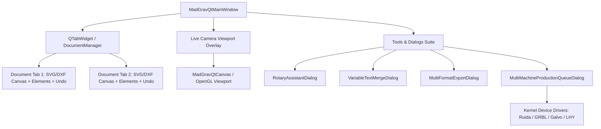

# Design Document: Comprehensive Laser Workstation Upgrades for MadGrav Qt

**Date:** 2026-08-14  
**Author:** DeepMind Agentic Pair Programmer & User  
**Status:** In Review  
**Target:** `madgrav/qt/`, `madgrav/tools/`, `madgrav/camera/`

---

## 1. Overview & Objectives

This specification defines the architecture, user experience, and technical implementation for 7 core laser workstation upgrades in **MadGrav Qt**:

1. **Multi-Document Tabs (Support Multi-Projets)**: Tabbed document management allowing multiple SVG/DXF projects open simultaneously with independent canvases, undo histories, and file states.
2. **Live Camera Bed Overlay (Superposition Caméra Direct)**: Real-time USB/RTSP camera video feed projected onto the bed canvas with opacity slider and homography calibration.
3. **Rotary Engraving Assistant (Assistant Gravure sur Cylindre)**: Step-by-step assistant for Chuck & Roller rotary fixtures with automatic step/mm calculation and 360° unwrap preview.
4. **Hardware-Accelerated OpenGL Canvas**: Viewport GPU rendering with `QOpenGLWidget` and level-of-detail optimization for 100k+ vector geometry.
5. **Direct Multi-Format Exporter**: One-click exporter for G-Code (`.gcode`/`.nc`), Ruida binary (`.rd`), Lihuiyu (`.egv`), `.dxf`, and `.svg`.
6. **Variable Text & CSV/Excel Batch Merge**: Data merging wizard supporting CSV/Excel spreadsheets, template token replacement, dynamic barcodes/QR codes, and grid replication.
7. **Multi-Machine Production Queue & Spooler**: Centralized spooler dispatching and monitoring jobs across multiple connected lasers (Ruida, GRBL, Galvo, Moshi, Newly).

---

## 2. Architecture & Components

---

## 3. Module Specifications

### Module 1: Multi-Document Tabs (`madgrav/qt/qt_main.py` & `madgrav/qt/qt_document.py`)
- **UI Element**: `QTabWidget` replacing the single central canvas container with closeable tabs (`setTabsClosable(True)`), add tab button (`+`), and keyboard shortcuts (`Ctrl+N`, `Ctrl+W`, `Ctrl+Tab`, `Ctrl+Shift+Tab`).
- **Document Model**: Each tab encapsulates:
  - Active file path (`file_path: Optional[str]`)
  - Dirty/unsaved flag (`is_modified: bool`)
  - Isolated elements root (`elements` instance)
  - Isolated Undo/Redo stack
  - Dedicated `MadGravQtCanvas`
- **Safety**: Prompt to save unsaved changes when closing an individual tab or exiting the application.

### Module 2: Live Camera Bed Overlay (`madgrav/qt/qt_canvas.py` & `madgrav/camera/`)
- **Rendering**: Background `QGraphicsPixmapItem` or custom `drawBackground` painting the latest frame from `CameraService` beneath vector elements.
- **Controls**:
  - Toolbar toggle button: 📷 *Activer/Désactiver Caméra Lit*.
  - Opacity slider in View Toolbar (0% to 100%).
  - Bed calibration overlay (perspective warp and bed homography alignment).

### Module 3: Rotary Engraving Assistant (`madgrav/qt/qt_laser_dialogs.py` & `madgrav/tools/rotary_assistant.py`)
- **Dialog Features**:
  - Fixture type: **Chuck (Mandrin à 3 mors)** vs **Roller (Rouleaux d'entraînement)**.
  - Material parameters: Diameter (mm), Length (mm), Circumference display.
  - Driver settings: Motor steps/revolution, microstepping, gear reduction ratio, roller diameter.
  - Automatic calculation of **Pulses per mm** (pas/mm) and scale multiplier.
  - Direct machine configuration command generation (e.g. `$102=...` for GRBL, Vendor write for Ruida).
  - Unwrapped artwork preview and test rotation pulse.

### Module 4: OpenGL Hardware Acceleration (`madgrav/qt/qt_canvas.py`)
- **GPU Backend**: `from PyQt6.QtOpenGLWidgets import QOpenGLWidget`.
- **Viewport Optimization**:
  - Switchable via menu `Affichage -> Accélération Matérielle OpenGL` (persisted in `QSettings`).
  - Viewport update mode: `SmartViewportUpdate` with anti-aliasing hints.
  - High performance culling for objects outside the visible bounding viewport.

### Module 5: Direct Multi-Format Exporter (`madgrav/tools/multi_export.py` & `madgrav/qt/qt_laser_dialogs.py`)
- **Export Targets**:
  - **G-Code (.gcode, .nc)**: Standard CNC/Diode G-code with customizable laser power (S0–S1000), speeds (F), and air-assist M7/M8/M9 commands.
  - **Ruida RD (.rd)**: Binary laser job files ready for USB flash drives.
  - **Lihuiyu EGV (.egv)**: Compact hardware bytecodes for K40 stock controllers.
  - **Clean CAD (.dxf, .svg)**: Color-coded layers mapped to cut/engrave operations.
- **Dialog**: `MultiFormatExportDialog` allowing format selection, file destination, origin preset, and export confirmation.

### Module 6: Variable Text & CSV/Excel Merge (`madgrav/tools/variable_text.py` & `madgrav/qt/qt_laser_dialogs.py`)
- **Wizard**: `VariableTextMergeDialog`
  - Load CSV or Excel (`.csv`, `.xlsx`) files with real-time `QTableWidget` preview.
  - Token syntax: `{Nom}`, `{Prenom}`, `{Matricule:04d}`, `{QR:https://...}`, `{Date:YYYY-MM-DD}`.
  - Automatic Barcode & QR-code generator per row.
  - Grid layout configuration: Rows, Columns, X/Y Spacing in mm, Auto-Nesting on bed.

### Module 7: Multi-Machine Production Queue & Spooler (`madgrav/tools/production_queue.py` & `madgrav/qt/qt_laser_dialogs.py`)
- **Spooler Manager**:
  - Multi-machine job assignment: Associate jobs with specific connected machines (e.g. Laser #1 Ruida CO2, Laser #2 GRBL Diode, Laser #3 Galvo Fiber).
  - Live progress bars, estimated duration, job status (En attente, En cours, Terminé, En pause, Erreur).
  - Batch job queueing with automatic pause between plates for material loading.

---

## 4. Verification Plan

### Automated Unit & Integration Tests:
- `test/test_qt_multi_document_tabs.py`: Multi-tab creation, switching, closing, independent undo histories.
- `test/test_qt_rotary_and_camera_overlay.py`: Rotary calculations, camera background overlay painting, homography.
- `test/test_qt_multi_export_formats.py`: G-Code, Ruida RD, Lihuiyu EGV, DXF/SVG generation and validity.
- `test/test_qt_variable_text_csv_merge.py`: CSV parsing, token substitution, dynamic barcode generation, batch placement.
- `test/test_qt_multi_machine_queue.py`: Multi-machine job queue dispatching, progress tracking.

### Regression Verification:
- Run entire suite `unittest discover test` to guarantee 100% pass rate.
